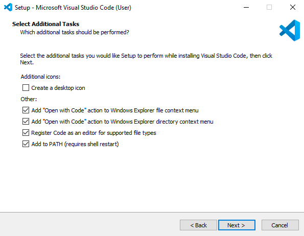

# Install VSCode Text Editor

Now it's time to install VSCode Text Editor, a sophisticated text editor for code, markup, and prose.

To get started, download [VSCode](https://code.visualstudio.com/download), install VSCode.

## Windows Users

Make sure to select the following is selected:

Run the following command in your terminal.

- `sudo apt-get install wget ca-certificates`

When install finished, **Close** your terminal.

## Mac and Linux USers Only: Manually Open VSCode / Shell Commands

- Launch The VS Code Application

[VSCode's documentation](https://code.visualstudio.com/docs) is excellent. Review it now to familiarize yourself with the basics.

Open the **Command Palette** (⇧⌘P) and type 'shell command'

Then, click the **Shell Command: Install 'code' command in PATH** command.

Close your terminal

## Confirm VS Code is working

Open your terminal and run this command:

`code .`

## All Users: Install VSCode Extensions

1. To add extensions to VSCode, open up VSCode. On the bottom left hand side you will see a settings ("gear") icon.  Click this, then click "Extensions". A side-bar will slide out and at the top you can search for the listed extensions below, and click the green 'Install' button for each:

- liveserver
- ESLint
- markdownlint
- editorconfig
- HTML Preview
- Thunder Client
- **Windows Users Only:** Remote WSL
  - Close and re-open VS Code (`code .`).
  - WSL users will see some updates to VS Code in the terminal. Once VS Code opens, a restart message may appear.
  - Restart VS Code.

VSCode should open up and show a list of files in the current directory.
There are many other extensions to choose from that will make your coding life a lot easier. Your instructors, TAs and classmates will all be great resources as to what works well for them.

---

### [⇐ Previous](./9-eslint.md) | [Next ⇒](./11-verify.md)
